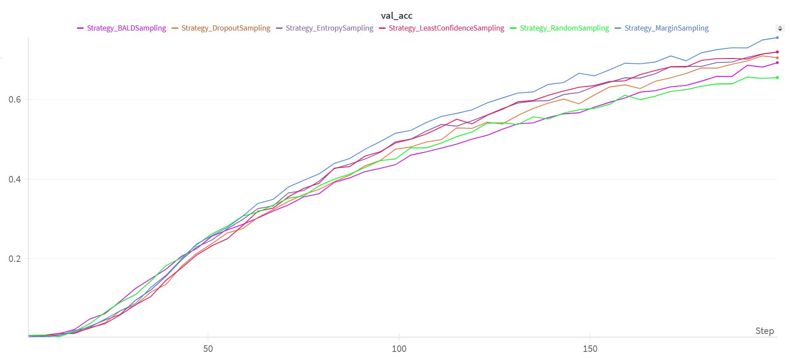
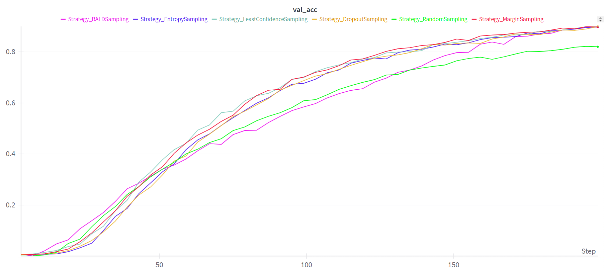

# Han Nom Recognition - Active Learning

## 1. Giới thiệu

Dự án này triển khai các chiến lược Active Learning cho bài toán nhận diện chữ Hán Nôm. Bằng cách sử dụng các phương pháp lấy mẫu chủ động khác nhau, kỹ thuật Active Learning giúp tối ưu hóa hiệu suất mô hình với lượng dữ liệu cần gán nhãn là ít hơn.

## 2. Tổng quan Active Learning

**Active Learning** là một phương pháp giúp **định nghĩa các mẫu dữ liệu cần thiết cho quá trình gán nhãn** (human annotation), đặc biệt hữu ích khi việc thu thập hoặc dán nhãn dữ liệu tốn kém hoặc khó khăn.

Thay vì sử dụng một lượng lớn dữ liệu có nhãn ngay từ đầu, Active Learning giúp mô hình học hiệu quả bằng cách **chọn lọc những dữ liệu quan trọng mà mô hình muốn học để con người gán nhãn**, từ đó cải thiện hiệu suất của mô hình với ít dữ liệu hơn.

### Các thuật ngữ:

-   **Query Strategy:** Thuật toán để chọn mẫu dữ liệu gán nhãn gọi là **_query strategy_** (chiến lược truy vấn) hoặc **_sampling strategy_** (chiến lược lấy mẫu).

-   **Oracle:** Tổ chức chịu trách nhiệm gán nhãn cho dữ liệu (ground truth). Có thể là một outside system hoặc một human annotator.

-   **Stopping Conditions:** Điều kiện để kết thúc quá trình training là khi hiệu suất của mô hình có thể đạt đến mức ổn định, độ chính xác đạt được như kì vọng hoặc quá trình lặp của active learning đạt đến số lượng mẫu dữ liệu được gắn nhãn định trước.

### Mục tiêu của Active Learning:

-   Định nghĩa và đo lường **mức độ quan trọng của từng mẫu dữ liệu** đối với mô hình.
-   Giúp mô hình đạt được độ chính xác mong muốn với **chi phí thấp nhất** (thời gian, công sức và tiền bạc).
-   Kết hợp giữa human và machine intelligence để **tối đa hoá độ chính xác** cho mô hình học máy.
-   Giúp các mô hình học máy đạt được sự **tổng quát hoá** hơn với các loại dữ liệu trên thực tế.

### Active Learning Pipeline:

1. Unlabelled Data (Dữ liệu chưa gán nhãn):

    - Tập dữ liệu đầu vào chưa có nhãn.

    - Mô hình cần xác định những mẫu dữ liệu nào có độ không chắc chắn cao để yêu cầu gán nhãn.

2. Sampling Data (Chọn mẫu dữ liệu):

    - Sử dụng các chiến lược Active Learning như Least Confidence, Entropy Sampling, BALD,... để chọn ra các mẫu dữ liệu có tiềm năng giúp cải thiện mô hình.

3. Human Annotator (Tổ chức gán nhãn):

    - Gán nhãn cho các mẫu dữ liệu được chọn.
    - Sau khi gán nhãn, dữ liệu này được thêm vào tập huấn luyện.

4. Labelled Data (Dữ liệu đã gán nhãn):

    - Tập dữ liệu đã được gán nhãn để huấn luyện mô hình.

5. Training a Model (Huấn luyện mô hình):

    - Mô hình được huấn luyện với tập dữ liệu mới để cải thiện hiệu suất.

6. Making Predictions (Dự đoán dữ liệu mới):

    - Mô hình đưa ra dự đoán trên dữ liệu chưa gán nhãn và quay lại bước chọn mẫu dữ liệu.

    - Quá trình lặp lại cho đến khi đạt được hiệu suất mong muốn.

### Ba hướng data sampling chính:

-   **Random sampling:** là chiến lược đơn giản nhất nhưng cũng thường kém hiệu quả nhất. Từ tập dữ liệu không có nhãn, chọn ngẫu nhiên một tập con các mẫu dữ liệu để gán nhãn và đưa vào training.

-   **Uncertainty sampling:** là một tập hợp các kĩ thuật để đánh giá và lựa chọn các **unlabeled data** dựa trên **mức độ quan trọng** của nó với mô hình. Ví dụ với mô hình **phân loại nhị phân** thì các mẫu dữ liệu cho ngưỡng xác suất gần 0.5 (eg: [0.45 → 0.55]) gọi là **uncertain** hay **confused**. Các mẫu dữ liệu này cần gán nhãn bởi con người.

-   **Diversity sampling:** xác định các mẫu **unlabeled data** mà chúng đang không nằm trong phân phối dữ liệu (**underrepresented**) hay **chưa được biết đến bởi mô hình** ở thời điểm hiện tại. Phương pháp này tập trung tìm các **đặc trưng hiếm gặp** trong dữ liệu huấn luyện hiện tại để tiến hành gán nhãn thêm. Mục tiêu là tìm ra một tập hợp các mẫu có thể đại diện tốt cho toàn bộ phân phối dữ liệu.

## 3. Uncertainty Sampling

> $\phi(x)$ là độ không chắc chắn của mô hình đối với mẫu dữ liệu $x$.

Dự án này triển khai các phương pháp lấy mẫu sau:

### a. Random Sampling

Chọn ra ngẫu nhiên các mẫu dữ liệu để gán nhãn.

### b. Least Confidence Sampling

Chọn ra các mẫu dữ liệu mà hiện tại mô hình có độ tự tin (confidence) khi dự đoán thấp nhất.

$$\phi_{LC}(x) = 1 - P_\theta(y_1^* \mid x)$$

Chỉ số này **càng cao** thì độ tự tin khi dự đoán của mô hình cho mẫu dữ liệu đó càng thấp.

### c. Margin Sampling

Chọn mẫu có chênh lệch nhỏ nhất giữa hai lớp dự đoán có xác suất cao nhất.

$$\phi_{MC}(x) = P_\theta(y_1^* \mid x) - P_\theta(y_2^* \mid x)$$

Nếu như khoảng cách này **càng nhỏ** thì chứng tỏ mô hình càng phân vân với mẫu dữ liệu này và cần phải đưa nó vào gán nhãn.

### d. Ratio Sampling

Chọn mẫu dựa trên tỉ lệ giữa hai lớp dự đoán có xác suất cao nhất.

$$\phi_{RC}(x) = \frac{P_\theta(y_1^* \mid x)}{P_\theta(y_2^* \mid x)}$$

Tỉ lệ này **càng nhỏ** chứng tỏ mô hình càng phân vân với các mẫu dữ liệu này.

### e. Entropy-based Sampling

Chọn mẫu có độ bất định cao nhất dựa trên entropy.

$$\phi_{ENT}(x) = -\sum_{i} P_\theta(y_i \mid x) log_2 P_\theta(y_i \mid x)$$

Entropy là đại lượng để đo mức độ hỗn loạn hay mức độ không ổn định của một phân phối dữ liệu. Chúng ta sẽ lựa chọn các prediction có entropy **cao nhất** để đưa vào gán nhãn.

### f. Monte Carlo Dropout Sampling

**Dropout** là **tắt ngẫu nhiên** một số nơ-ron trong các hidden layers thường sử dụng khi training.

**Monte Carlo Dropout** (MC Dropout) là kĩ thuật sử dụng **dropout trong quá trình inference** để xác định mức độ **uncertainty** của các input samples.

Để thực hiện MC Dropout, mỗi mẫu dữ liệu sẽ được **inference lặp lại N lần** với các dropout khác nhau của mạng neural gốc, sau đó lấy trung bình kết quả của N lần inference.

### g. BALD (Bayesian Active Learning by Disagreement) Sampling

Chọn mẫu dữ liệu dựa trên **thông tin tương hỗ** (mutual information) giữa model output và model parameters (weights/posterior).

$$I(y; \omega | x, D_{\text{train}}) \approx - \sum_c \left( \frac{1}{T} \sum_t p_c^t \right) \log \left( \frac{1}{T} \sum_t p_c^t \right) + \frac{1}{T} \sum_{t,c} p_c^t \log p_c^t$$

Trong đó:

$p_c^t$ là xác suất dự đoán ra class c của mẫu dữ liệu input $x$ với model parameters $ω_t ∼ \text{posterior } q^∗_θ (ω)$.

$T$ là số lần inference.

Để có được thành phần đầu tiên, ta thực hiện chạy inference nhiều lần, lấy **trung bình các outputs** và đo lường **entropy** trên đó.

Để có được thành phần thứ hai, ta thực hiện chạy inference nhiều lần, tính toán **entropy của output mỗi lần chạy** sau đó tính **giá trị trung bình.**

## 4. Thực nghiệm

### Yêu cầu hệ thống

-   python >= 3.8.0
-   numpy
-   torch
-   torchvision
-   pillow
-   matplotlib
-   tqdm
-   wandb

### Mục tiêu

Đánh giá hiệu quả của các chiến lược Active Learning cho bài toán nhận diện chữ Hán Nôm, nhằm giảm số lượng dữ liệu cần gán nhãn mà vẫn đảm bảo hiệu suất mô hình.

### Dữ liệu và Mô hình

-   Dữ liệu: Tập dữ liệu chữ Hán Nôm **wb_recognition_dataset** phân loại **2139** chữ cái gồm:

    -   **56813** ảnh cho tập train
    -   **1392** ảnh cho tập validation

-   Phân chia: Tập train ban đầu được chia ra thành 2 phần:

    -   Tập **labeled** là tập dữ liệu có nhãn với số lượng nhất định.
    -   Tập **unlabeled** là tập dữ liệu được đánh dấu là chưa gán nhãn để sử dụng trong quá trình lấy mẫu.

-   Mô hình: Kiến trúc mạng **EffcientNetB7**.

### Quy trình thực nghiệm

1. **Chuẩn bị dữ liệu và mô hình:**

    - Giả lập chia tập train thành tập gán nhãn labeled gồm N_INIT_LABELED ảnh và tập chưa gán nhãn unlabeled gồm các ảnh còn lại.
    - Khởi tạo kiến trúc mô hình (EfficientNetB7) và cấu hình các tham số cần thiết.

2. **Huấn luyện ban đầu:**

    - Huấn luyện mô hình với N_EPOCHS trên tập labeled.
    - Đánh giá hiệu suất mô hình trên tập validation.

3. **Vòng lặp Active Learning:**

    - Lặp qua các lần lấy mẫu theo số lượng mẫu N_SAMPLES và số vòng N_ROUNDS, tức là sau mỗi round sẽ chọn ra N_SAMPLES mẫu dữ liệu để gán nhãn và thêm vào tập labeled:

        1. **Inference và đo lường độ không chắc chắn:** Sử dụng chiến lược AL được chọn (Margin, MC Dropout...) để tính toán độ không chắc chắn cho từng mẫu trong tập unlabeled.
        2. **Chọn mẫu cần gán nhãn:** Lấy N_SAMPLES mẫu dữ liệu dựa trên độ không chắc chắn tính được ở chiến lược AL.
        3. **Gán nhãn:** Giả lập việc gán nhãn các mẫu đã chọn và đưa vào tập labeled.
        4. **Huấn luyện lại mô hình:** Huấn luyện mô hình với tập labeled mới vừa được cập nhật.
        5. **Đánh giá:** Kiểm tra hiệu suất mô hình trên tập validation và ghi nhận kết quả.

4. **Kiểm tra điều kiện dừng:**

    - Kết thúc quá trình lặp khi đạt đủ số vòng quy định hoặc khi hiệu suất mô hình đạt được mức kỳ vọng.

5. **Ghi nhận và phân tích kết quả:**

    - Tổng hợp các chỉ số hiệu suất qua từng round.
    - So sánh hiệu quả của các chiến lược AL và mô hình không dùng AL.

### Các vấn đề cần giải quyết

1. Nếu không dùng AL thì cùng một lượng dữ liệu sẽ đạt được độ chính xác (accuracy) là bao nhiêu % ?

2. Cho trước một accuracy kỳ vọng thì cần bao nhiêu dữ liệu để đạt được accuracy đó?

3. Ba tham số N_INIT_LABELED, N_SAMPLES, N_ROUNDS chọn như thế nào (ngẫu nhiên)?

### Kết quả thực nghiệm

| (N_INIT_LABELED, N_SAMPLES, N_ROUNDS) → TOTAL_SAMPLES | (1000, 2000, 15) → 29000 | (2000, 500, 30) → 16500 | (5000, 1000, 30) → 34000 | (1000, 1000, 30) → 30000 | (2000, 100, 50) → 6900 | (2000, 200, 50) → 11800 |      All data      |
| :---------------------------------------------------: | :----------------------: | :---------------------: | :----------------------: | :----------------------: | :--------------------: | :---------------------: | :----------------: |
|                         BALD                          |        **92.718**        |            -            |          94.253          |        **95.429**        |         69.31          |            -            |         -          |
|                      MC Dropout                       |          92.576          |         92.241          |          94.612          |          94.826          |         71.01          |        **89.95**        |         -          |
|                        Margin                         |          92.098          |       **92.629**        |          93.463          |          95.322          |       **75.62**        |          89.72          |         -          |
|                        Entropy                        |            -             |         91.810          |            -             |          95.181          |         71.97          |          89.69          |         -          |
|                   Least Confidence                    |            -             |         89.727          |        **95.854**        |          95.004          |         72.01          |          89.85          |         -          |
|                        Random                         |          89.759          |         87.757          |          92.529          |          92.417          |         65.56          |          82.00          |         -          |
|                         No AL                         |          91.739          |         89.224          |          92.601          |          92.098          |           -            |            -            | **94.109** (56813) |

Kết quả thực nghiệm với bộ 3 tham số: (N_INIT_LABELED, N_SAMPLES, N_ROUNDS) = **(1000, 1000, 30)**

Kết quả thực nghiệm với bộ 3 tham số: (N_INIT_LABELED, N_SAMPLES, N_ROUNDS) = **(2000, 100, 50)**

Kết quả thực nghiệm với bộ 3 tham số: (N_INIT_LABELED, N_SAMPLES, N_ROUNDS) = **(2000, 200, 50)**

### Phân tích kết quả

-   Từ bảng kết quả thực nghiệm, ta thấy với cùng một lượng dữ liệu thì các chiến lược AL dựa trên độ không chắc chắn như BALD, MC Dropout, Margin và Entropy giúp mô hình đạt độ chính xác cao hơn so với phương pháp Random Sampling và mô hình không sử dụng Active Learning.

-   Với một giá trị accuracy kỳ vọng là **94%**, nếu không sử dụng AL thì mô hình cần phải huấn luyện trên **toàn bộ tập dữ liệu 56813 ảnh** để đạt được accuracy đó. Trong khi nếu sử dụng các chiến lược AL thì mô hình chỉ cần khoảng 50% lượng dữ liệu **(30000 ảnh)** để đạt độ chính xác 94% hoặc thậm chí cao hơn (trên 95%).

-   Việc lựa chọn các tham số **(N_INIT_LABELED, N_SAMPLES, N_ROUNDS)** thì tùy thuộc vào nhiều yếu tố như số class cần phân loại, lượng dữ liệu hiện có, khả năng gán nhãn của người dùng... nhưng qua thực nghiệm để các chiến lược AL hoạt động tốt cần xem xét một số nhận định sau:

    -   **N_INIT_LABELED** nên được khởi tạo với lượng dữ liệu đủ lớn, ít nhất với số mẫu dữ liệu bằng số class của bài toán, tối ưu nhất là mỗi class nên có ít nhất một mẫu để đảm bảo độ bao phủ của tập labeled ban đầu. Nếu N_INIT_LABELED quá nhỏ thì những lần AL đầu tiên sẽ không có ý nghĩa vì gần như mô hình đều không chắc chắn với bất kì mẫu dữ liệu nào.

    -   **N_SAMPLES** được chọn tùy thuộc vào khả năng gán nhãn của người dùng sau mỗi vòng lặp AL. Từ kết quả thực nghiệm, ta có thể thấy tham số này **càng nhỏ** thì hiệu suất của mô hình sau mỗi round **càng được cải thiện**. Tuy nhiên, đổi lại thì thời gian huấn luyện mô hình sẽ càng lớn. Còn nếu, tham số này càng lớn thì chi phí gán nhãn càng cao và chất lượng dữ liệu ở mỗi round có thể không tốt. Vì vậy, nên chọn một giá trị phù hợp trong khoảng từ **0.1% đến 1%** lượng dữ liệu có trong tập unlabeled.

    -   **N_ROUNDS** cũng được chọn tùy thuộc vào thời gian training và khả năng gán nhãn của người dùng. Gọi **TOTAL_SAMPLES** là tổng lượng dữ liệu người dùng có thể gán nhãn thì **N_ROUNDS** được tính bằng công thức sau:

$$\verb|N_ROUNDS| = \frac{\verb|TOTAL_SAMPLES | - \verb| N_INIT_LABELED|}{\verb|N_SAMPLES|} + 1$$

Tóm lại, so với không sử dụng Active Learning (No AL), các chiến lược trên giúp mô hình đạt được độ chính xác tương đương hoặc cao hơn với lượng dữ liệu cần gán nhãn ít hơn, từ đó giảm chi phí và thời gian cho quá trình annotation.

### Kết Luận và Hướng Phát Triển

-   Các chiến lược Active Learning đều góp phần giảm số lượng dữ liệu gán nhãn so với phương pháp lấy mẫu ngẫu nhiên hoặc huấn luyện truyền thống trong khi vẫn đảm bảo hiệu suất của mô hình.

-   Hướng phát triển:

    -   Thử nghiệm trên các mô hình khác hoặc trên các tập dữ liệu lớn hơn.
    -   Tìm hiểu và triển khai thêm các chiến lược sampling (lấy mẫu).
